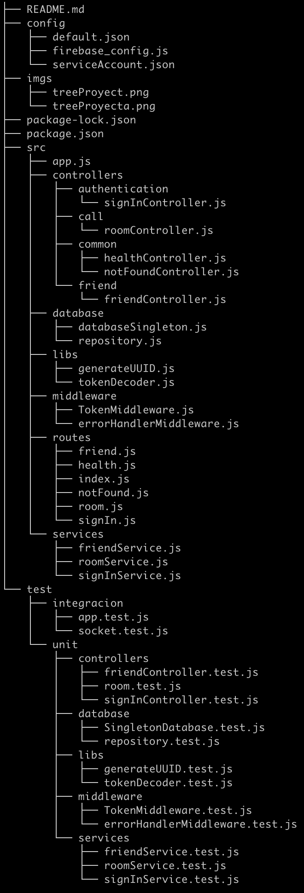
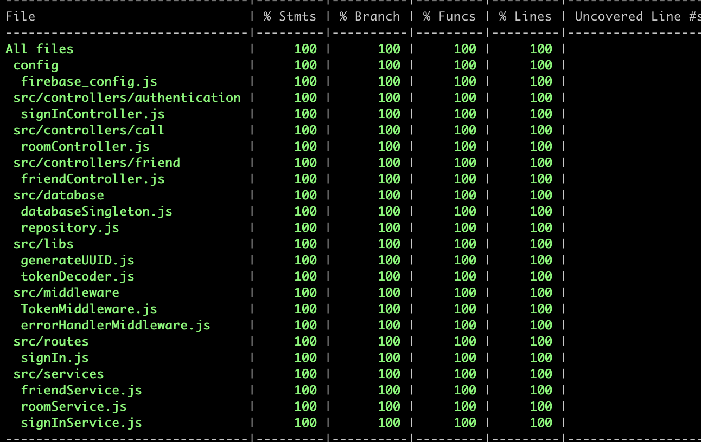

# ChatApiRestFul

### Funcionalidades 

1. LogIn
2. ABM de conocidos
3. ABM de Rooms
4. Desarrollo de Chat

### Reglas de negocio

- Los usuarios deben tener una cuenta para acceder a la página.
- Las interacciones son de carácter audiovisual, teniendo a su vez un chat de texto el cual no es persistente dentro del sistema.
- Las interacciones tienen un limite de tiempo (30 segundos).
- Los usuarios deben de poder finalizar cualquier interacción incluso antes de lo estimado por el temporizador.
- Los usuarios tienen la posibilidad de coincidir en pasarse agregarse mutuamente una vez concluida la interacción.
- Las interacciones son anónimas, no se comparte ningún tipo de información hasta que ambas partes coincidan en añadirse por la plataforma de manera mutua.

## Routes

- Health   
- GET
* http://localhost:3000/api/health

- SignIn
- POST
* http://localhost:3000/api/signin

- Room
- GET
* http://localhost:3000/api/room
- PUT
* http://localhost:3000/api/room/removeUser

- Friend
- GET
- POST
- DELETE
* http://localhost:3000/api/friend'

## Controllers

## Test Coverage åå

